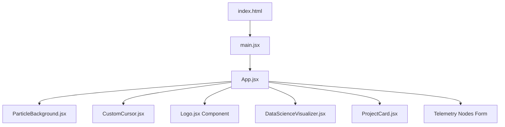

# 🌌 Premium Data Science & Full-Stack Portfolio

<div align="center">
  <!-- Inline Glowing SVG Logo -->
  <svg width="120" height="120" viewBox="0 0 100 100" fill="none" xmlns="http://www.w3.org/2000/svg">
    <defs>
      <linearGradient id="readme-u-grad" x1="0%" y1="0%" x2="100%" y2="100%">
        <stop offset="0%" stop-color="#10b981" />
        <stop offset="100%" stop-color="#06b6d4" />
      </linearGradient>
      <linearGradient id="readme-k-grad" x1="0%" y1="0%" x2="100%" y2="100%">
        <stop offset="0%" stop-color="#8b5cf6" />
        <stop offset="100%" stop-color="#ec4899" />
      </linearGradient>
    </defs>
    <circle cx="50" cy="50" r="42" stroke="#10b981" stroke-width="1.5" stroke-dasharray="6 3" opacity="0.3" />
    <path d="M 28 25 L 28 58 A 12 12 0 0 0 52 58 L 52 25" stroke="url(#readme-u-grad)" stroke-width="7" stroke-linecap="round" stroke-linejoin="round" />
    <path d="M 52 43 L 72 23 M 52 43 L 72 63" stroke="url(#readme-k-grad)" stroke-width="7" stroke-linecap="round" stroke-linejoin="round" />
  </svg>
  
  <h1>Patnala Uday Kumar</h1>
  <p><b>Associate Software Engineer & Data Science Specialist</b></p>

  <p align="center">
    
    
    
    
    
  </p>
  
  <p>
    A premium, highly-interactive, dual-theme developer portfolio custom-crafted for recruiters and corporate hiring managers. Built with <b>React</b>, <b>Tailwind CSS v4</b>, and <b>Framer Motion</b>.
  </p>
</div>

---

## ⚡ Interactive Features & Animation Details

This website features advanced visual interactions designed to impress engineering teams:

*   **Self-Drawing Brand Logo:** A custom geometric **UK** logo that draws its vector lines dynamically upon load using Framer Motion SVG path interpolation.
*   **Active Section Scroll Spy:** An IntersectionObserver monitors which section is currently active and animates a gradient accent bar sliding smoothly across navigation menu buttons.
*   **3D Layered Parallax Profile:** Moving the mouse tilts the hero profile assembly:
    *   *Back:* Ambient glow radial layer `translateZ(-40px)`.
    *   *Mid-Back:* Spinning orbit ring `translateZ(10px)`.
    *   *Mid-Front:* Counter-spinning dashed orbit ring `translateZ(30px)`.
    *   *Front:* Radial-gradient masked portrait photo `translateZ(50px)`.
*   **3D Viewport Unfold Scroll:** Outer section envelopes are mounted inside 3D perspective scroll triggers that unfold from the page as the visitor scrolls down.
*   **Cybernetic Trailing Target Cursor:** A dual-element cursor featuring a central bright dot and an outer dashed target ring. The outer ring follows the pointer coordinates with an elastic linear interpolation (lerp) delay. When hovering over links or buttons, the ring expands, changes to cyan, and glows. On click events, both elements contract and flash purple.
*   **Ambient Soundtrack Equalizer:** A floating glassmorphic audio player pill at the bottom-left corner playing a progressive synth track at low volume (`0.15`). Includes a 4-bar soundwave equalizer that pulses dynamically when playing and freezes flat when paused. Implements autoplay safety by listening to the user's first click or keypress to begin playback.
*   **Micro-Interactive Project Tags:** Individual technology stack badges dynamically scale and light up in category-specific neon colors (emerald, cyan) when hovered.
*   **3D SGD Loss landscape:** Interactive visualizer representing a mathematical gradient loss field. Click and drag to rotate the field in 3D canvas coordinates.

---

## 📂 Featured Capstones (Recruiter-First Curation)

The portfolio showcases Uday's highest quality full-stack & data science Capstones:

| Capstone | Core Architecture | Tech Stack | Live Demo |
| :--- | :--- | :--- | :--- |
| **Music Mirror** | Real-time computer vision mood recognition musicrecommendation engine. | React, FastAPI, face-api.js, Python, Webcam API | [Explore Live](https://music-mirror.vercel.app) |
| **Nebula Gallery** | AI-assisted memory album with local folder ingest, indexing, and duplicate filters. | React, Node.js, Firebase, Gemini API, Dexie.js, GSAP | [Explore Live](https://nebula-nmo.vercel.app) |
| **JavaPath Pro** | Full-stack Java concepts sandbox learning platform with an adaptive AI mentor. | React, Vite, Node.js, Express, SQLite, Gemini API | [Explore Live](https://javapath-pro.vercel.app) |
| **Spedex Fintech** | Spend index and payment velocity aggregation dashboard. | Spring Boot, React Native, Expo, Kotlin, JWT | [Explore Live](https://spe-dex.vercel.app) |

---

## 🛠️ System Architecture



- **Runtime Environment:** React 19 (Vite)
- **Styling Paradigm:** Tailwind CSS v4.0 (Custom HSL theme tokens, glassmorphism card components, and floating glow filters)
- **Physics & Transforms:** Framer Motion spring controls & canvas pixel matrices

---

## 🚀 Local Deployment

### Prerequisites

Ensure you have **Node.js 20** or newer installed.

### Installation & Run

1.  **Clone the Repository:**
    ```bash
    git clone https://github.com/UdayPatnala/portifolio.git
    cd portifolio
    ```

2.  **Install Dependencies:**
    ```bash
    npm install
    ```

3.  **Boot Local Development Server:**
    ```bash
    npm run dev
    ```
    Open `http://localhost:5173` in your browser.

4.  **Produce Production Assets:**
    ```bash
    npm run build
    ```
    The compiled bundle will compile to the `dist/` directory.

---

<div align="center">
  <sub>Designed & Developed with ❤️ by Patnala Uday Kumar</sub>
</div>
