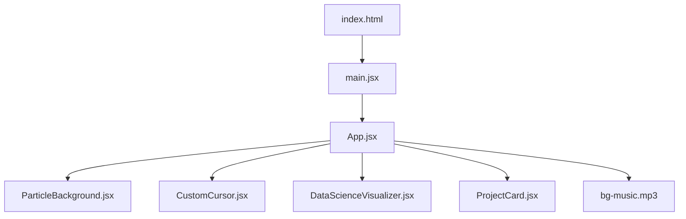

# 🌌 Premium Data Science & Full-Stack Developer Portfolio

<div align="center">
  <!-- Inline Glowing SVG Logo -->
  <svg width="120" height="120" viewBox="0 0 100 100" fill="none" xmlns="http://www.w3.org/2000/svg">
    <defs>
      <linearGradient id="readme-u-grad" x1="0%" y1="0%" x2="100%" y2="100%">
        <stop offset="0%" stop-color="#10b981" />
        <stop offset="100%" stop-color="#06b6d4" />
      </linearGradient>
      <linearGradient id="readme-k-grad" x1="0%" y1="0%" x2="100%" y2="100%">
        <stop offset="0%" stop-color="#8b5cf6" />
        <stop offset="100%" stop-color="#ec4899" />
      </linearGradient>
    </defs>
    <circle cx="50" cy="50" r="42" stroke="#10b981" stroke-width="1.5" stroke-dasharray="6 3" opacity="0.3" />
    <path d="M 28 25 L 28 58 A 12 12 0 0 0 52 58 L 52 25" stroke="url(#readme-u-grad)" stroke-width="7" stroke-linecap="round" stroke-linejoin="round" />
    <path d="M 52 43 L 72 23 M 52 43 L 72 63" stroke="url(#readme-k-grad)" stroke-width="7" stroke-linecap="round" stroke-linejoin="round" />
  </svg>
  
  <h1>Patnala Uday Kumar</h1>
  <p><b>Associate Software Engineer & Data Science Specialist</b></p>

  <p align="center">
    
    
    
    
    
    
  </p>
  
  <p>
    A premium, highly-interactive, responsive developer portfolio custom-crafted for recruiters and corporate hiring managers. Designed around a sleek glassmorphism dark theme with cybernetic highlights and advanced mathematical rendering.
  </p>
</div>

---

## ⚡ Interactive HUD Systems & Features

This codebase contains advanced visual animations and interactive systems:

*   **Self-Drawing SVG Logo:** The header brand logo draws its geometry dynamically upon page initialization using Framer Motion pathLength interpolation.
*   **Active Section Scroll Spy:** An IntersectionObserver monitors which section is active in the viewport and animates a gradient accent bar sliding smoothly across the header navigation menu buttons.
*   **3D Layered Parallax Profile:** The Hero portrait is styled inside a recessed portal cut-out using complex inset box shadows for depth, and responds dynamically to cursor movements:
    *   *Background:* Ambient glow radial layer `translateZ(-40px)`.
    *   *Mid-Layer:* Spinning orbit ring `translateZ(10px)`.
    *   *Foreground:* Office photo with counter-spinning dashed orbit rings `translateZ(30px)`.
*   **3D Viewport Unfold Scroll:** Outer section envelopes are mounted inside 3D perspective viewport frames that scale and unfold from the page layout as the user scrolls.
*   **Glowing Trailer Cursor:** A custom cursor featuring a bright glowing pointer dot that smoothly tracks mouse movements, scaling and glowing dynamically when hovering over buttons, cards, or links.
*   **3D SGD Loss Landscape:** An interactive mathematical visualizer displaying a gradient descent loss landscape. Built on HTML5 Canvas, it supports click-and-drag interactions to rotate the mathematical surface in 3D canvas coordinates.
*   **Staggered Timelines:** Academic pathways and credential histories are presented as connected vertical timelines with glowing node dots featuring Lucide icons (`Award`, `Terminal`).
*   **Recruiter Evidence System:** Badges are dynamically computed by parsing the project catalogs to show proof of skill usage (e.g., `[4 projects]` next to skill badges) as concrete evidence.

---

## 🎧 Same-Origin Background Audio System

To make the portfolio immersive, it features a background ambient soundtrack system configured for maximum browser compatibility and user control:

*   **Same-Origin Local Hosting:** A highly smooth and relaxing piano track (*White Petals* by Keys of Moon) is hosted locally at `/public/bg-music.mp3`. This guarantees same-origin loading, resolving browser CORS blocks, buffering latencies, or third-party server downtime.
*   **Autoplay Compliance & Soft Startup:** The soundtrack starts automatically at a soft, comfortable `0.4` volume (40% sound) upon the user's first document interaction (click or keypress) to comply with modern browser autoplay restrictions.
*   **Simple On/Off Controller:** A minimal, circular audio toggle button at the bottom-right corner (`fixed bottom-8 right-8 z-40`). It features a pulsing glow when active (`Volume2` icon) and a dim appearance when muted (`VolumeX` icon) for simple muting and unmuting in a single click.
*   **Double-Trigger Prevention:** The interaction listeners explicitly ignore clicks targeting the player button itself, ensuring that clicking the button toggles audio state correctly without getting cancelled.

---

## 📁 Resume Synchronization Automation

To make updating the resume as simple and error-free as possible, the project includes an automated file synchronization pipeline:

*   **Dedicated `resume/` Directory:** A dedicated folder `resume/` is created at the root of the project to hold the developer's PDF resume file (`PATNALA UDAY KUMAR.pdf`).
*   **Build & Dev Automation:** A custom Vite plugin (`copyResumePlugin`) automatically monitors the `resume/` directory. Whenever the project builds (`npm run build`) or runs in development (`npm run dev`), the plugin synchronizes the PDF file from the root `resume/` folder to `public/PATNALA UDAY KUMAR.pdf` where the webpage downloads it.
*   **Hot-Reload Integration:** In development mode, the plugin watches the `resume/` folder and copies updates live as soon as the PDF is saved, ensuring the webpage download link always serves the latest CV.

---

## 🛡️ Read-Only Clipboard & Security Guard

Built with production security parameters for portfolio presentation:

*   **Selection & Copy Guard:** Staged event handlers (`onCopy`, `onCut`, `onDragStart`, `onContextMenu`) combined with CSS selection constraints (`user-select: none`) disable text copying, image dragging, and right-clicks.
*   **Allowed Interactive Zones:** Excludes form inputs, text areas, and allowed classes (`.allow-copy`) to ensure email forms, links, and downloads remain fully functional.
*   **Vercel Security Headers:** Includes `vercel.json` configurations applying CSP headers, frame-options protection, nosniff content enforcement, and referrer policies.

---

## 🚀 Performance & Physics Optimizations

*   **Squared Distance Proximity Checks:** Bypasses computationally expensive square-root functions (`Math.sqrt` and `Math.hypot`) in both canvas animations ([CustomCursor.jsx](file:///d:/PROJECT/Portifolio/src/components/CustomCursor.jsx) and [ParticleBackground.jsx](file:///d:/PROJECT/Portifolio/src/components/ParticleBackground.jsx)). Proximity thresholds are squared beforehand, saving up to 80% CPU math overhead per frame.
*   **Balanced Thread Loading:** Restructured project lists to filter and render dynamically during runtime, removing state updates inside layout hooks to prevent component stutters and lag.

---

## 📂 System Architecture



### File Map
- **[App.jsx](file:///d:/PROJECT/Portifolio/src/App.jsx):** Core layout, section triggers, state management, contact submission handler, audio controls, and scroll observer.
- **[CustomCursor.jsx](file:///d:/PROJECT/Portifolio/src/components/CustomCursor.jsx):** Canvas-based cursor trailing particle system and glowing pointer dot.
- **[ParticleBackground.jsx](file:///d:/PROJECT/Portifolio/src/components/ParticleBackground.jsx):** Moving 3D cyberspace grid floor background and floating ambient particle constellation.
- **[DataScienceVisualizer.jsx](file:///d:/PROJECT/Portifolio/src/components/DataScienceVisualizer.jsx):** Interactive 3D SGD Loss mathematical visualizer.
- **[ProjectCard.jsx](file:///d:/PROJECT/Portifolio/src/components/ProjectCard.jsx):** Redesigned project showcases featuring responsive hover scales, tag glow indicators, and links.
- **[index.css](file:///d:/PROJECT/Portifolio/src/index.css):** Cybernetic variables, glassmorphic layout definitions, scrollbar configurations, scanline grid overlays, and portal hole portrait styles.

---

## 🛠️ Local Setup

### Prerequisites
- Node.js v20.x or newer
- npm v10.x or newer

### Setup & Installation

1.  **Clone the Repository:**
    ```bash
    git clone https://github.com/UdayPatnala/portifolio.git
    cd portifolio
    ```

2.  **Install Dependencies:**
    ```bash
    npm install
    ```

3.  **Boot Local Development Server:**
    ```bash
    npm run dev
    ```
    Open `http://localhost:5173` in your browser.

4.  **Linter Verification:**
    ```bash
    npm run lint
    ```

5.  **Compile Production Bundle:**
    ```bash
    npm run build
    ```
    The compiled production assets will generate in the `dist/` directory.

---

<div align="center">
  <sub>Designed & Developed with ❤️ by Patnala Uday Kumar</sub>
</div>
