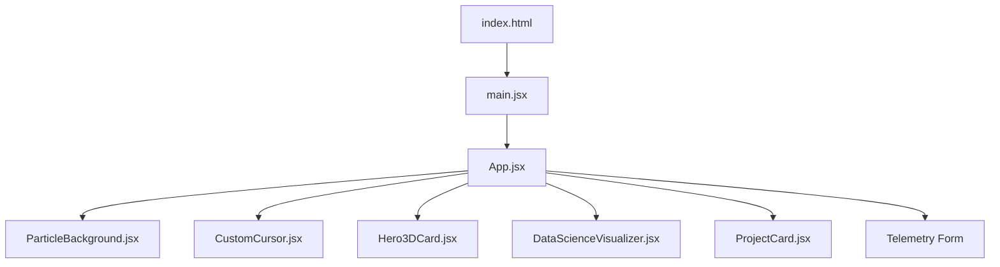

# 🌌 Premium Data Science & Full-Stack Portfolio

<div align="center">
  
  
  
  
  
</div>

<p align="center">
  A premium, highly-interactive, dual-theme developer portfolio custom-crafted for <b>Patnala Uday Kumar</b>. Built with <b>React</b>, <b>Tailwind CSS v4</b>, and <b>Framer Motion</b>, it showcases computer science expertise with a focus on Data Science, ML pipelines, and Full-Stack Systems.
</p>

---

## ⚡ Key Highlights & Visual Flair

This portfolio is not just a static page—it is designed to showcase engineering capabilities through interactive, math-oriented visualizations:

*   **Ambient Particle Canvas:** A canvas-based node network drifting and connecting dynamically, reacting to cursor proximity (simulating neural networks or data clusters).
*   **Antigravity Custom Cursor:** A custom cursor trail utilizing spring physics:
    *   *Inner Precise Dot:* Emerald green target selector.
    *   *Outer X-Ray Circle:* Powered by CSS `mix-blend-difference` to invert the colors of all text, buttons, and headings underneath it. It morphs into a rounded-corner badge on interactive targets.
*   **Parallax 3D Profile Frame:** An interactive tilt card containing portrait options, featuring real-time mouse-tracking tilt angles and light glares.
*   **3D Stochastic Gradient Descent Optimizer:** An interactive 3D loss landscape simulating gradient descent optimization. Users can click and drag to rotate the landscape in 3D space.
*   **Dual UI Blueprint Theme:**
    *   *Dark Mode (Terminal):* Obsidian background with glowing emerald green, mint teal, and amber mathematical matrix cues.
    *   *Light Mode (Blueprint):* Crisp slate-50 background styled as a green engineering graph paper grid.

---

## 📂 Project Showcase (Vercel Integrations)

The capstone archives display real, local workspaces backed by active Vercel deployments, complete with embedded interface screenshots:

| Project | Description | Stack | Live Preview |
| :--- | :--- | :--- | :--- |
| **Music Mirror** | Real-time facial expression music player | React, FastAPI, face-api.js, Python | [Explore](https://music-mirror.vercel.app) |
| **Nebula Cinematic Gallery** | AI memory album with local folder ingest | React, Express, Firebase, Gemini API, Dexie.js | [Explore](https://nebula-nmo.vercel.app) |
| **JavaPath Pro** | Corporate ticket sandbox learning platform | React, Node.js, SQLite, Gemini API | [Explore](https://javapath-pro.vercel.app) |
| **Spedex Fintech** | Spend index and payment velocity dashboard | Spring Boot, React Native, Expo, Kotlin | [Explore](https://spe-dex.vercel.app) |
| **SkyFlow Weather** | Stream ingestion & structured logging pipeline | Python, Pandas, Streamlit, Open-Meteo | [Explore](https://uday-skyflow.vercel.app) |
| **Churn Prediction** | Model pipeline probability estimator | Scikit-learn, FastAPI, Streamlit, Joblib | [Explore](https://churn-prediction-system.vercel.app) |
| **TaskMaster Pro** | Passcode-secured workflow workspace | React, Radix UI, Framer Motion, Docker | [Explore](https://uday-taskmaster-pro.vercel.app) |
| **JobFlow Copilot** | Compliant resume keywords adaptor | HTML5, Vanilla JS, Gemini API, PowerShell | [Explore](https://uday-jobflow-copilot.vercel.app) |

---

## 🛠️ Architecture & Tech Stack



- **Core Framework:** React 19 (Vite)
- **Styling Engine:** Tailwind CSS v4.0 (combining modern utility tokens and custom glassmorphism filters)
- **Animation Engine:** Framer Motion (for smooth 3D tilting, layout transitions, and scroll animations)
- **Database (Client-side):** LocalStorage for telemetry form submissions and theme preference caching.

---

## 🚀 Getting Started

### Prerequisites

Ensure you have **Node.js 20** or newer installed.

### Installation

1.  **Clone the Repository:**
    ```bash
    git clone https://github.com/UdayPatnala/portifolio.git
    cd portifolio
    ```

2.  **Install Dependencies:**
    ```bash
    npm install
    ```

3.  **Run Development Server:**
    ```bash
    npm run dev
    ```
    Open `http://localhost:5173` in your browser.

4.  **Build Production Bundle:**
    ```bash
    npm run build
    ```
    The optimized assets will be outputted to the `dist/` directory.

---

<div align="center">
  <sub>Built with ❤️ by Patnala Uday Kumar</sub>
</div>
